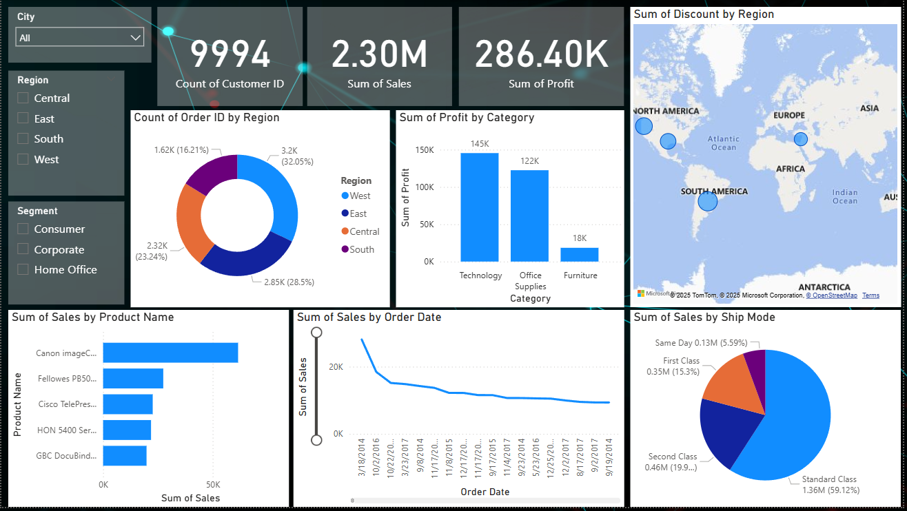

# Superstore-Sales-Analysis-Power-BI-Dashboard

# Business Insights – Superstore Dashboard

## 1. Overall Performance
- The business has generated **$2.30 million** in sales with a net profit of **$286.40K**, indicating a profit margin of approximately **12.5%**.
- This suggests there is room for improvement in cost management or pricing strategies to boost profitability.

## 2. Regional Trends
- The **West** region accounts for the highest number of orders (**32%**), showing strong market engagement.
- However, further analysis is needed to ensure this high volume translates into sustainable profits.
- The discount map highlights regions (e.g., parts of **South America**) where discounts are significantly high, possibly impacting margins.

## 3. Category Profitability
- **Technology** products lead in profit contribution, followed by **Office Supplies**.
- The **Furniture** category performs poorly in terms of profit, suggesting a need to re-evaluate its pricing, discounting, or shipping policies.

## 4. Shipping Preferences
- Most customers prefer **Standard Class** shipping (**59%**), likely due to its cost-effectiveness.
- **Same Day** delivery has a small share (**5.6%**), indicating either low demand or limited availability.
- Offering faster shipping at competitive rates could improve customer satisfaction or unlock premium revenue streams.

## 5. Top Products
- The **Canon imageCLASS** product stands out as the best-selling item.
- Other products like **Fellowes PB500** and **Cisco TelePresence** also perform well — they can be leveraged further through promotions or bundling strategies.

## 6. Sales Over Time
- A clear decline in sales over time is visible, which may point to reduced marketing efforts, market saturation, or seasonal variation.
- Addressing this trend through targeted campaigns or new customer acquisition strategies could help recover growth.

## 7. Filters for Deeper Analysis
- The use of filters like **City**, **Region**, and **Segment** allows interactive exploration.
- These filters can help uncover underperforming customer segments or regions that require focused action.

